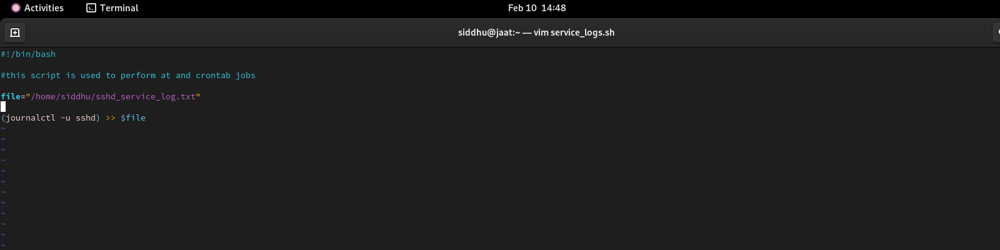
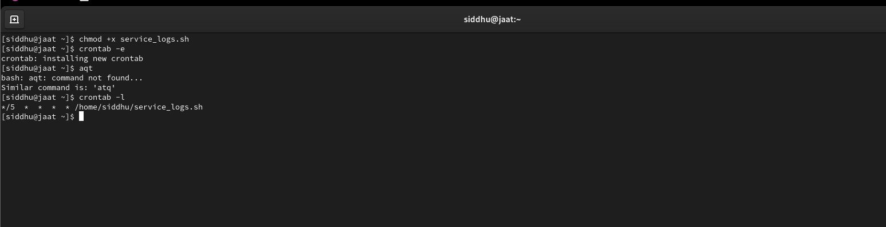
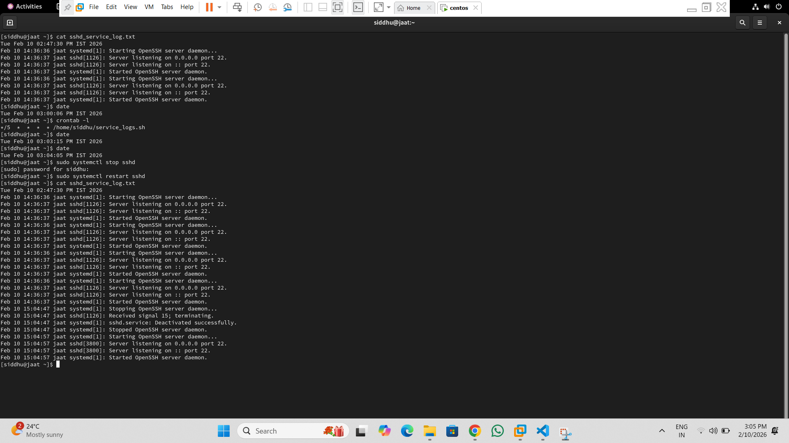
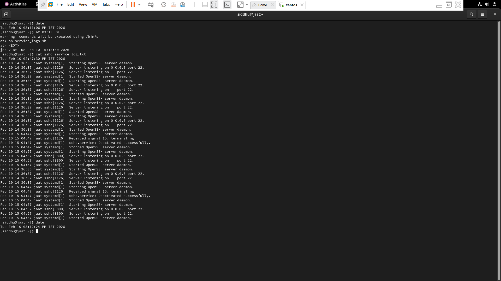
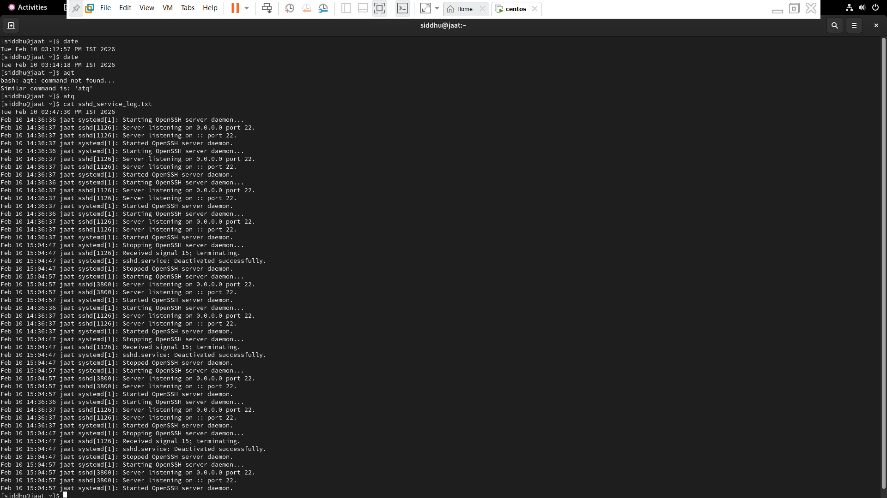

# Cron Jobs and Task Scheduling (My Notes)

Task scheduling is something I learned after realizing that **many Linux tasks
don’t need to be run manually every time**.

Things like:
- backups
- log cleanup
- monitoring disk space
- running scripts at fixed times

are usually handled using **cron jobs** or **at jobs**.

This file contains the cron and scheduling commands I actually use while
practicing Linux and automation.

---

##  What Is Cron?

Cron is a Linux service that runs commands or scripts automatically
at scheduled times.

It is mostly used for **repeated tasks**.

---

##  Cron Service Check

Before using cron, make sure it is running:

```bash
systemctl status crond

 crond.service - Command Scheduler
     Loaded: loaded (/usr/lib/systemd/system/crond.service; enabled; preset: enabled)
     Active: active (running) since Mon 2026-02-09 18:04:55 IST; 35min ago
   Main PID: 1162 (crond)
      Tasks: 1 (limit: 10301)
     Memory: 3.6M (peak: 6.3M)
        CPU: 415ms
     CGroup: /system.slice/crond.service
             └─1162 /usr/sbin/crond -n
```

##  Crontab Basics
```bash

Cron Time Format
* * * * * command
| | | | |
| | | | └── Day of week (0–7)
| | | └──── Month (1–12)
| | └────── Day of month (1–31)
| └──────── Hour (0–23)
└────────── Minute (0–59)
```
Each user has their own cron table (crontab).
```bash
crontab -e  #Edit crontab

crontab -l  #List cron jobs

crontab -r  #Remove all cron jobs
```
example:
```bash
#for this first create a script file 
#A script file is for take the sshd service log
vim service_logs.sh
#make file executive
sudo chmod +x service_logs.sh
#now set crontab job
crontab -e
*/5 * * * * /home/siddhu/service_logs.sh
```



##  Cron Job Examples
```bash
* * * * * /home/siddhu/script.sh  #Run script every minute

0 8 * * * /home/siddhu/backup.sh  #Run script every day at 8 AM

0 10 * * 0 /home/siddhu/weekly_task.sh  #Run script every Sunday

*/5 * * * * /home/siddhu/monitor.sh  #Run script every 5 minutes
```


##  Using at Command (One-Time Jobs)
```bash
at 10:30  #Schedule a job
sh /home/siddhu/test.sh  #Press Ctrl + D to save

atq  #List at jobs
atrm <job_id>  #Remove at job
```



