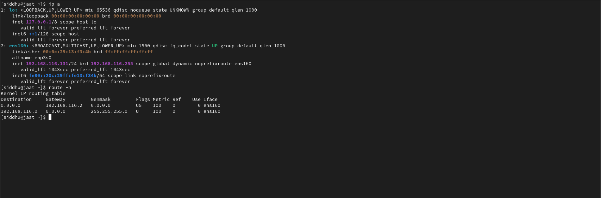
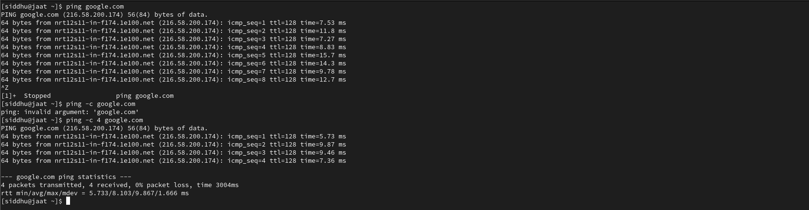
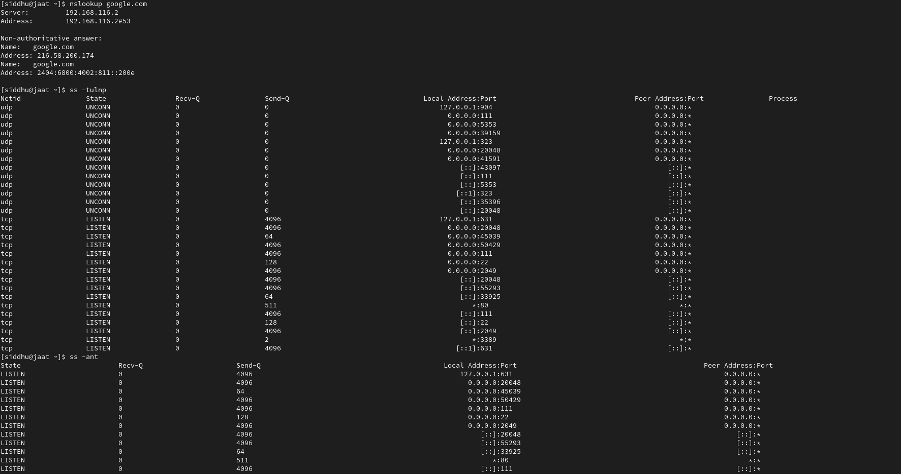
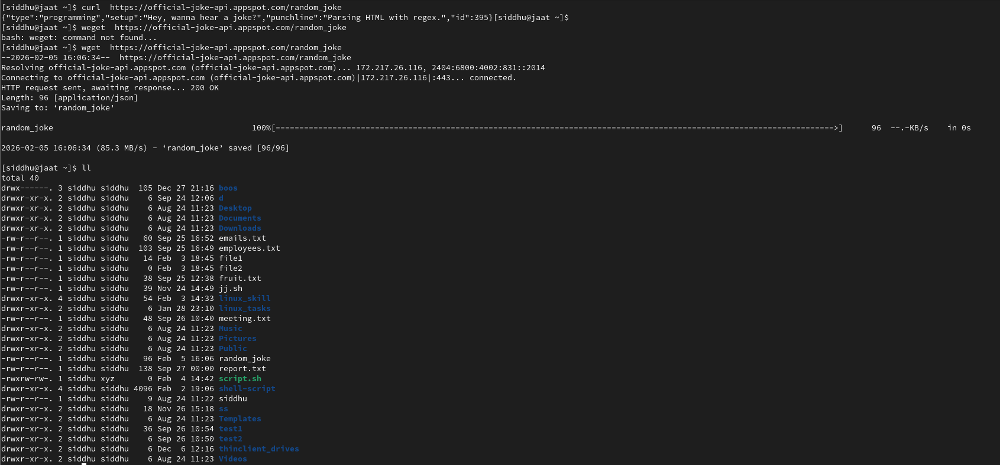
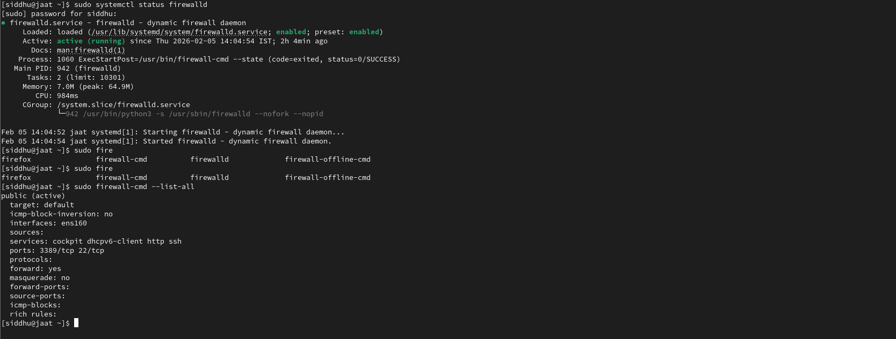

# Linux Networking Basics (My Notes)

Networking is one of those Linux topics that you understand better only after
working on real servers.

While practicing Linux and DevOps, I regularly use these commands to:
- check server connectivity
- debug network issues
- verify open ports and services
- access remote machines

This file contains the **basic networking commands and notes** that I personally
use during practice and real troubleshooting.

## Checking Network Interfaces

### Show IP addresses

```bash
ip a
ifconfig  #another command
route -n  #Default gateway
```

### Connectivity Testing
```bash
ping google.com  #Ping a host
ping -c 4 google.com  #Limit packets
```

### Check DNS resolution
```bash
nslookup google.com
```
### Checking Open Ports
```bash
ss -tulnp  #List listening ports
ss -ant  #Checking Active Connections
```

### Downloading Files
```bash
curl https://example.com  #Using curl
curl -O https://example.com/file.zip  #Download file
wget https://example.com/file.zip  #Using wget
```

### Remote Server Access (SSH)
```bash
ssh user@server_ip  #Connect to remote server
ssh siddhu@192.168.1.10  #Example
scp file.txt user@server_ip:/home/user/  #Copy files securely
```
### Firewall Basics
```bash
sudo systemctl status firewalld  #Check firewall status
sudo firewall-cmd --list-all  #List firewall rules
```

### Network Troubleshooting Tools
```bash
traceroute google.com
mtr google.com
```

