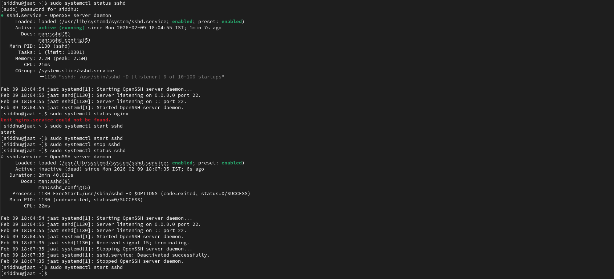
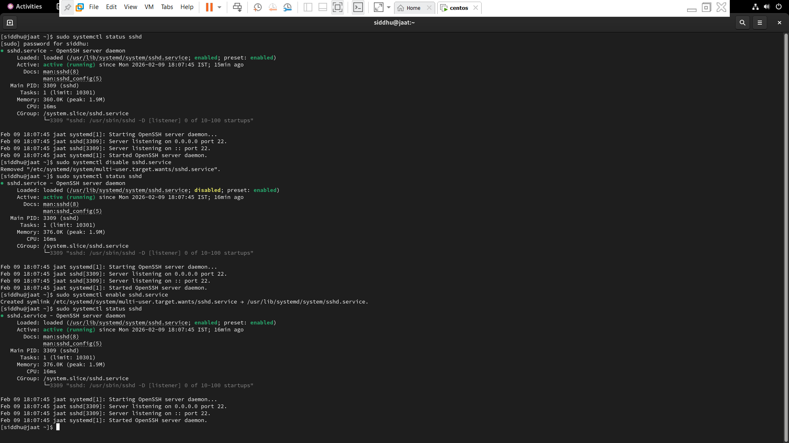
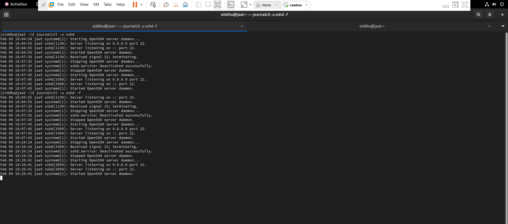

# Linux Service Management (My Notes)

While working on Linux servers, services are something you deal with almost
every day — web servers, SSH, databases, monitoring agents, etc.

Knowing how to **check, start, stop, and troubleshoot services** is a basic
requirement for system admins and DevOps roles.

These are the commands I personally use while practicing on VMs and servers.

---

##  What Is a Service?

A service is a background process that runs continuously, such as:
- sshd
- nginx
- apache (httpd)
- docker
- cron

Most modern Linux systems use **systemd** to manage services.

---

##  Checking Service Status

```bash
systemctl status sshd

  sshd.service - OpenSSH server daemon
     Loaded: loaded (/usr/lib/systemd/system/sshd.service; enabled; preset: enabled)
     Active: active (running) since Mon 2026-02-09 18:04:55 IST; 1min 7s ago
       Docs: man:sshd(8)
             man:sshd_config(5)
   Main PID: 1130 (sshd)
      Tasks: 1 (limit: 10301)
     Memory: 2.2M (peak: 2.5M)
        CPU: 21ms
     CGroup: /system.slice/sshd.service
             └─1130 "sshd: /usr/sbin/sshd -D [listener] 0 of 10-100 startups"
```
##  Starting and Stopping Services

```bash
sudo systemctl start sshd  #Start a service

sudo systemctl stop sshd  #Stop a service

sudo systemctl restart sshd  #Restart a service
```


##  Enable or Disable Services 
```bash
sudo systemctl enable sshd  #Enable service on system

sudo systemctl disable sshd  #Disable service from starting
```


##  Viewing Service Logs
```bash
journalctl -u sshd  #To check logs of a specific service

journalctl -u sshd -f  #Logs
```

